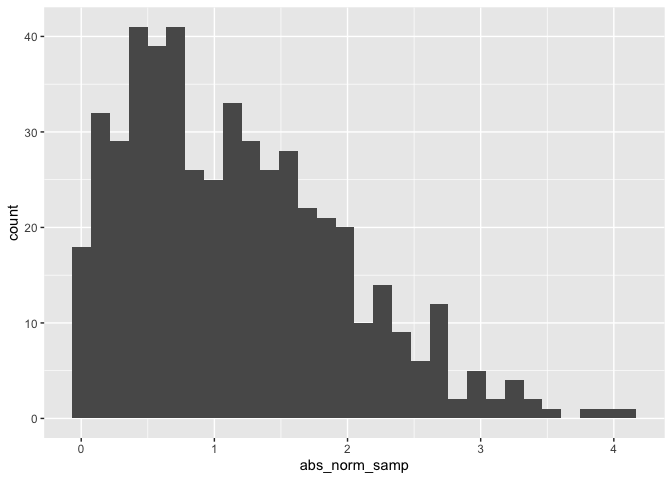
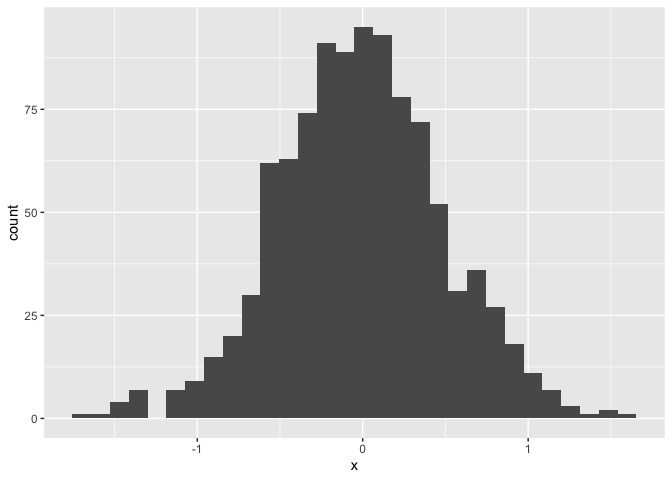
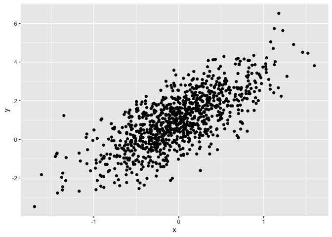

Simple document
================

I’m an R Markdown document!

# Section 1

Here’s a **code chunk** that samples from a *normal distribution*:

``` r
samp = rnorm(100)
length(samp)
```

    ## [1] 100

# Section 2

I can take the mean of the sample, too! The mean is 0.0365972.

The chunk below creates a dataframe containing a sample of size 500 from
a random normal variable, constructs the specified logical vector, takes
the absolute value of each element of that sample,and produces a
histogram of the absolute value. The code chunk also finds the median of
the sample and stores it for easy in-line printing.

``` r
library(tidyverse)

la_df = tibble(
  norm_samp = rnorm(500, mean = 1),
  norm_samp_pos = norm_samp > 0,
  abs_norm_samp = abs(norm_samp)
)

ggplot(la_df, aes(x = abs_norm_samp)) + 
    geom_histogram()
```

    ## `stat_bin()` using `bins = 30`. Pick better value `binwidth`.

<!-- -->

``` r
median_samp = median(pull(la_df, norm_samp))
```

The purpose of this file is to examine a few data types (or data
classes) in R.

First we create a dataframe containing variables of four different
types.

``` r
example_df = tibble(
  vec_numeric = 5:8,
  vec_char = c("My", "name", "is", "Jeff"),
  vec_logical = c(TRUE, TRUE, TRUE, FALSE),
  vec_factor = factor(c("male", "male", "female", "female"))
)
```

The variable `vec_numeric` has class integer, and the variable
`vec_factor` has class factor.

The purpose of this file is to present a couple of basic plots using
`ggplot`.

First we create a dataframe containing variables for our plots.

``` r
set.seed(1234)

plot_df = tibble(
  x = rnorm(1000, sd = .5),
  y = 1 + 2 * x + rnorm(1000)
)
```

First we show a histogram of the `x` variable.

``` r
ggplot(plot_df, aes(x = x)) + 
    geom_histogram()
```

    ## `stat_bin()` using `bins = 30`. Pick better value `binwidth`.

<!-- -->

Next we show a scatterplot of `y` vs `x`.

``` r
ggplot(plot_df, aes(x = x, y = y)) + 
    geom_point()
```

<!-- -->
